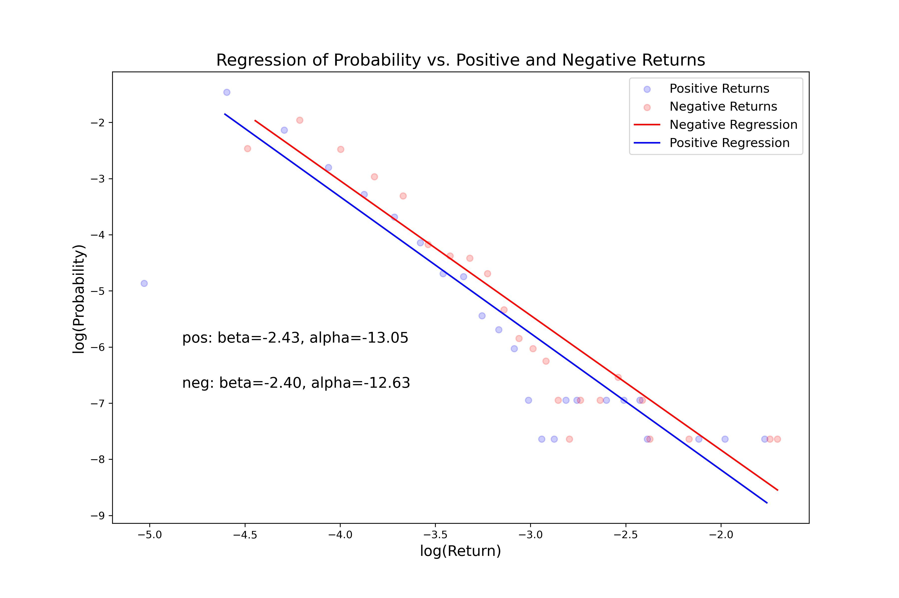

# BlackSwan

Everybody knows the word :)

It is really unpredictable? what does it mean by unpredictable? what kind of distribution it follows? Do positive and negative events differ?

Bouchaud, Jean-Philippe, et al. "Taming large events: Optimal portfolio theory for strongly fluctuating assets." International Journal of Theoretical and Applied Finance 1.01 (1998): 25-41.

It's an empirical study of the beginning section of the paper.

And the conclusion is that the expectation of the return for BTC_1h is not divergent, but the variance is. And it follows the power law as described by the paper.

The difficult part is that for the power law, if the lower moment (mean/variance) is divergent, then in order to get a number, probability or whatever, one would ineivitably need a strong biased prior. 

Log-Log regression for BTC hourly return in the range of (-1, -1%) & (1%, 1)

