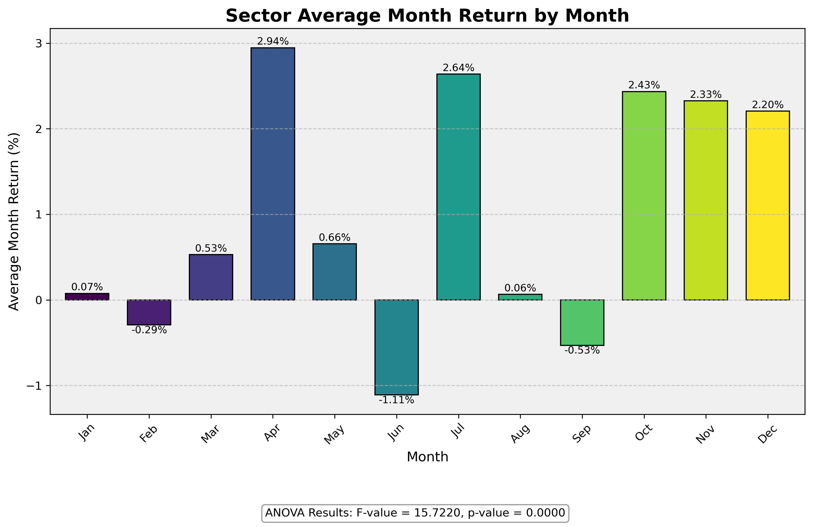

## Weekend/Weekday Effect on Sector Statistics

This project includes an analysis of the weekday effect on bank sector (top30 Market Cap + DB, 2000 onwards). We examine how the Banks sector performs on different days of the week, compared to classic behavior financial theory. This analysis can reveal which days tend to be most profitable for bank stocks

## Causal Study of the Statistics

The analysis further includes a causal study controlling the possible confounders @config.yaml, confirming the causality of the weekend effect (the bar effect in on next business day). 

## Bulge Bracket

Goldman Sachs (GS) exhibits distinct patterns on Mondays, potentially attributable to its quantitative and algorithmic trading/proprietary trading. 

## What About Month?

While this time the possibly confounders are numerous, 
@config.yaml. We confirm the sector performs well in Apr, Jul, Oct, Nov, Dec but with different weights.

