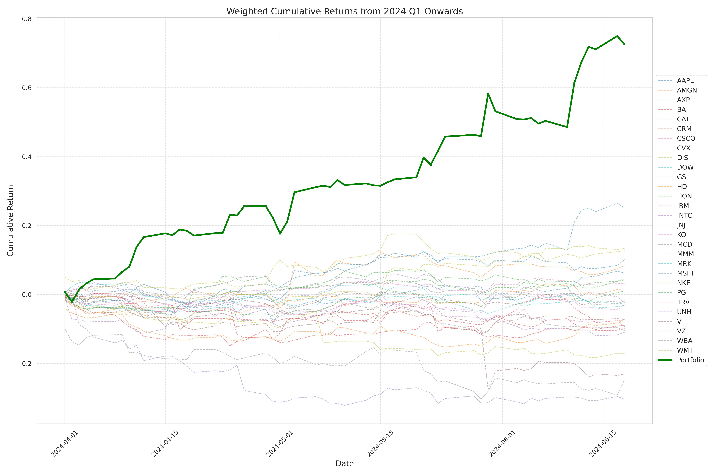

## Hypothesis

The company's financial statements have a causal impact on quarterly returns, with adjustments made to account for the confounding influences of the specified quarter, sector, and additional treatment-specific confounders.

### Brief

The causal_study.ipynb notebook identified the causal impact of key metrics that led to accurate decision-making, such as the top three long positions (AAPL, MSFT, WMT) and the top three short positions (IBM, BA, TRV). The portfolio_study_result.ipynb notebook incorporated these causal insights into portfolio optimisation.

Since estimating expected returns can be challenging, future approaches may involve using the betas of causal factors or adopting the Black-Litterman Bayesian framework. For the covariance matrix, historical returns were used, as the causal inference controlled the tickers within the same sector, implying uniform betas across the sector.

Alternatively, instead of considering the entire sector, individual stocks can be studied separately. This would involve calculating their specific factor loadings, aligning the analysis within the scope of the factor model.

### $\sigma$ = 0.3, realized Sharpe ratio: 5.96

